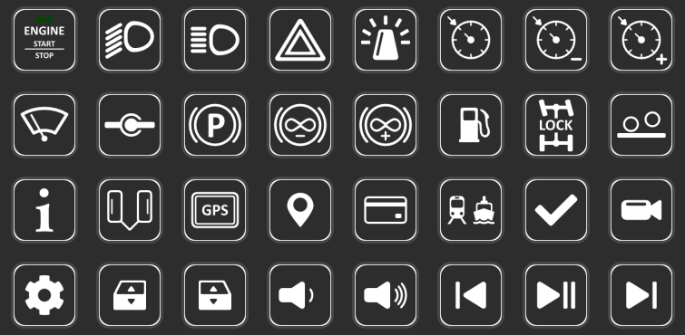
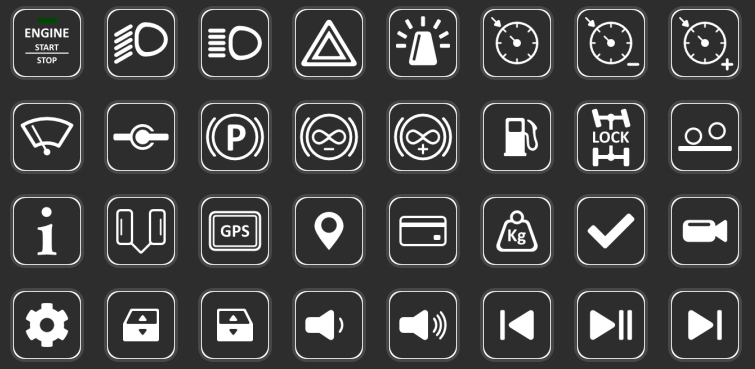

# streamdeck-icons
An icons set to use with your Elgato StreamDeck

## Previews

### Euro Truck Simulator 2

### American Truck Simulator

## Resources

All icons are designed with [Affinity Designer](https://affinity.serif.com/fr/designer/). Exported PNGs are stored within **dist** directory with size 128x128.

## How to use

Please consider map missing shortcuts within the game or adapt yours within StreamDeck profile directly.

## Crédits

* Some of icons are based on [FontAwesome](https://fontawesome.com/) libray.
* Games launchers icons are coming from [Wikipedia]()https://www.wikipedia.org/